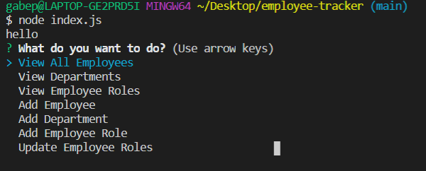

# Employee Tracker
In this project i was able to create a console app where the user can control their and view their employees and business by adding them to a data base in order to maintain all of the info using SQL

## Image of the APP

## Built With

* [Javascript](https://www.javascript.com/)
* [Node.js](https://nodejs.org/en/)
* [NPM](https://www.npmjs.com/)
* [NPM Inquirer](https://www.npmjs.com/package/inquirer)
* [MySQL](https://www.mysql.com/)
## Code Snippet
    The code below is how i was able to ask the user for its desired action and set up the correct functions in order to do exactly what they want

    function begin(){
  inquirer.prompt({
    type: "list",
    message: "What do you want to do?",
    name: "nextStep",
    choices: [
      
        "View All Employees",
        "View Departments",
        "View Employee Roles",
        "Add Employee",
        "Add Department",
        "Add Employee Role",
        "Update Employee Roles"
    ],
    name:  "choice"   
  }).then(res => {
    switch(res.choice){
      case "View All Employees":
        viewEmployee();
        break;
      case "View Departments":
        viewDepartment();
        break;
      case "View Employee Roles":
        viewRoles();
        break;
      case "Add Employee":
        addEmployee();
        break;
      case "Add Department":
        addDepartment();
        break;
      case "Add Employee Role":
        addRole();
        break;
      case "Update Employee Roles":
        updateRole();
        break;
    }
  })
}

## Github Repository
- [Employee Template Repo](https://github.com/GabrielPineda808/employee-tracker)
## Authors

* **Gabriel Pineda** 

- [Link to Github](https://github.com/GabrielPineda808)
- [Link to LinkedIn](https://www.linkedin.com/in/gabriel-pineda-a94535195/)